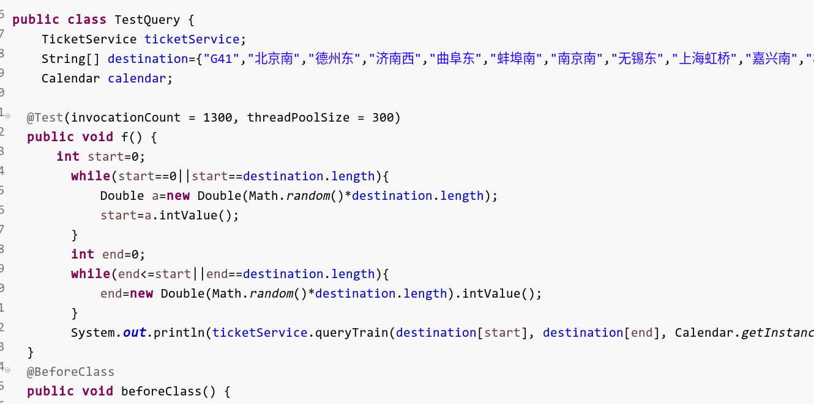
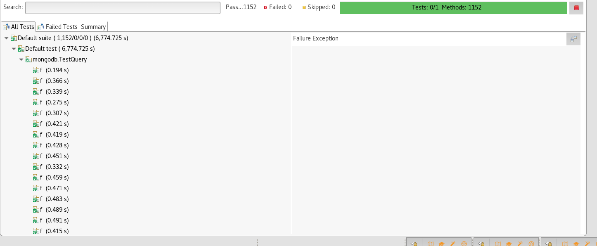
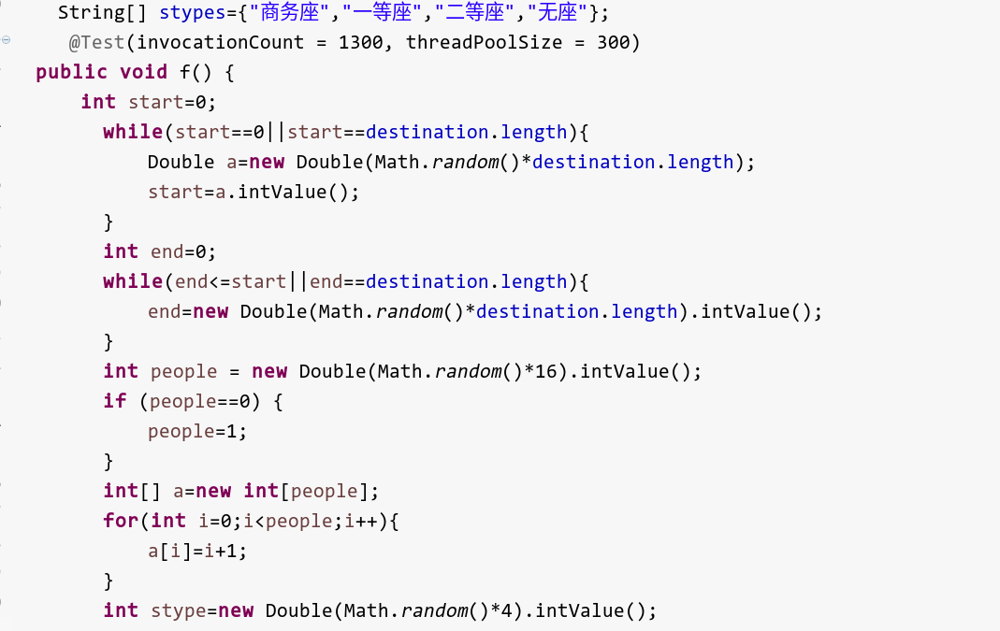
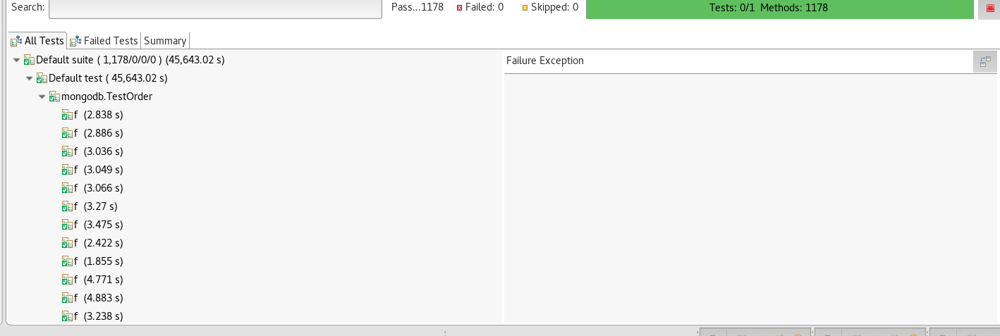

# 基于MongoDB的非关系型数据库的设计

## 总述

这是第一次接触mongodb，也是第一次接触nosql，还是长进了很多。nosql的反范式既带来了很多方便之处，也会带来很多问题。另外，我整整花了一天去看mongdb入门和指南，里面的集群、分片看得人心情激动，结果发现这次作业根本永不上。。。这次报告分为以下部分：
* 表结构设计
* 嵌套与引用的取舍
* 数组和文档的取舍
* 代码上的find、aggreate
* 分布式集群部署的想法

## 数据库部分

这次的表结构主要侧重于车辆，建立了account、train和各车次的座位表

### account

表结构如下

    {
        "_id" : ObjectId("58280720a2541e22f85565d3"),
        "aid" : NumberInt(2),
        "email" : "cx1@example.com",
        "password" : "tttggg1frr",
        "customer" : [
            {
                "cid" : NumberInt(1),
                "name" : "赵邪",
                "identity" : NumberInt(210938724)
            },
            {
                "cid" : NumberInt(2),
                "name" : "钱毒",
                "identity" : NumberInt(-1198134629)
            },
            {
                "cid" : NumberInt(3),
                "name" : "孙帝",
                "identity" : NumberInt(182520786)
            },
            {
                "cid" : NumberInt(4),
                "name" : "李丐",
                "identity" : NumberInt(-1743738851)
            },
            {
                "cid" : NumberInt(5),
                "name" : "周神通",
                "identity" : NumberInt(-1425288376)
            },
            {
                "cid" : NumberInt(6),
                "name" : "吴飞",
                "identity" : NumberInt(-828427247)
            },
            {
                "cid" : NumberInt(7),
                "name" : "郑峰",
                "identity" : NumberInt(151924128)
            },
            {
                "cid" : NumberInt(8),
                "name" : "王复",
                "identity" : NumberInt(-76435042)
            }
        ]
    }

与MySQL的最大不同在于将customer内嵌在里account里面，有利于快速找到account下对应的乘车人信息。

### train

结构如下：

    {
        "_id" : ObjectId("58280739a2541e21ccaecc33"),
        "tid" : "G5",
        "type" : "8",
        "北京南" : {
            "orderNum" : NumberInt(1),
            "length" : 0.0
        },
        "济南西" : {
            "orderNum" : NumberInt(2),
            "length" : 226.73024791129538
        },
        "南京南" : {
            "orderNum" : NumberInt(3),
            "length" : 688.1776165110065
        },
        "上海虹桥" : {
            "orderNum" : NumberInt(4),
            "length" : 1304.2388924644924
        }
    }

生硬的将站名直接放入了文档之中，这么做而不采取嵌套的原因是，我发现mongo对表内比较很不擅长。就是比如想找到发车时间比G5早的车，这样的操作并不擅长。因此选择这样放置，利用了mongo不必统一列名的特点
表中的length指从始发站到某站的距离。type代表是8车或者16车

### G？

***这张表的设计不是很好，应当把所有车辆放在一起，便于集群***

    {
        "_id" : ObjectId("582808a4a2541e063004f3c9"),
        "date" : ISODate("2016-11-12T13:49:00.340+0000"),
        "stype_0" : [
            NumberInt(40),
            NumberInt(40),
            NumberInt(40),
            NumberInt(40)
        ],
        "stype_1" : [
            NumberInt(160),
            NumberInt(160),
            NumberInt(160),
            NumberInt(160)
        ],
        "stype_2" : [
            NumberInt(500),
            NumberInt(500),
            NumberInt(500),
            NumberInt(500)
        ],
        "stype_3" : [
            NumberInt(100),
            NumberInt(100),
            NumberInt(100),
            NumberInt(100)
        ],
        "ticket" : [
            {
                "stype" : "0",
                "t_c_id" : NumberInt(1),
                "row" : NumberInt(1),
                "location" : NumberInt(0),
                "ticket" : NumberInt(2147483647)
            },
            {
                "stype" : "0",
                "t_c_id" : NumberInt(1),
                "row" : NumberInt(1),
                "location" : NumberInt(1),
                "ticket" : NumberInt(2147483647)
            },
            {
                "stype" : "0",
                "t_c_id" : NumberInt(1),
                "row" : NumberInt(1),
                "location" : NumberInt(2),
                "ticket" : NumberInt(2147483647)
            },

这张表中date代表时间，之后的stype是各种座位在各个站的剩余票数。与MySQL设计不同，我这里决定牺牲买票时多update一次来换取查票时的快捷，设计本身应该是服务于生产环境的，所以难说哪个更好。之后的ticket是长度为800/1160的表，每一个元素代表一个座位，与MySQL一样，还是以32位的1代表全部有票（虽然一般只用到10位）。

>查票步骤 
> 先通过train去找可行的车次 
>有了cache，就比较简单，首先先找出出发、到达站在路线上的编号，之后将数组进行切片取最小值即可。

>买票操作 
> 首先确认余票数量是否足够（相当于再查一次），然后先修改cache中的内容，将数组对应部分都减去票数。之后去更新对应座位下的bit。

* 发现mongo对于bit的支持还是很好的，有bitallset，不过刚开始搞不清set和clear
* 查票等操作运用了aggreate操作来实现，感觉很有函数式编程的感觉

### 嵌套还是引用

在课外书上讲，引用用于对于一致性要求很高的地方，而嵌套的好处是查询方便。因为系统中其他的表对于嵌套内容并不有获取，加上查询第一，因此选择了嵌套。但是，嵌套是以牺牲范式为代价的，造成了查询代码及其恐怖，这里要吐槽一下，其实和mongo结合最好的还是js，javan给人苯苯的感觉。回归正题，嵌套需要注意的是层数不要太深，否则更新会有很大麻烦，变得很慢。甚至上，如果我们有插入需求，那么倘若插入的内容超过了磁盘上预留的空间，就会有很大的灾难。

### 数组还是文档

选择了嵌套，还要面对另外的选择，是嵌套数组还是文档，这里是看了mongo的50个技巧才知道的，如果内部东西的条目比较整齐，并且查询多是eq，选择文档，否则选数组

## 代码部分

个人认为代码部分是此次的难点，原因是学习曲线太陡峭，SQL不能使用。

### aggreate操作

这是本次最大的收获之一，了解了这个操作怎么用，有什么作用。发现它酷似java8中的stream流操作，这是本次作业中的代码：

    AggregateIterable<Document> aggregateIterable=
    collection.aggregate(Arrays.asList(

    					Aggregates.match(Filters.and(Filters.gte("date", start),Filters.lt("date", end))),
    					Aggregates.unwind("$ticket",unwindOptions),
    					Aggregates.match(
                Filters.and(Filters.eq("ticket.stype", Integer.toString(seats2stype(seats_type))),
              Filters.bitsAllSet("ticket.ticket", mask))),
    					Aggregates.limit(len),
    					Aggregates.project(Projections.exclude("date","stype_0","stype_1","stype_2","stype_3"))

    					));

先过滤，再解开数组，之后再次过滤，限定个数后进行投影操作。这是在为顾客具体分配座位。个人认为这样的操作是所谓的无副作用的，任意的元素通过之后的结果一样，并且不改变元素本身，应该是可用于分布式环境的，mapreduce这次还未用到。。。

### findandupdate

这个也是mongo的惊喜之一，这个设计是找到并修改，返回的是修改前的内容。想起MySQL的时候分配座位特别想要这样的操作，却只能硬生生的用成transaction，这里感到很满足。

## 展望

mongo给我最大的感觉是，不用分布不算用。。。因为基本每一本书都有介绍它的集群配置mongos，然后设置备份，如何分片、如何加入集群等等的配置。因此假如有集群，应该会把seats合道一张表里面，用gid、date进行分片，account应该使用身份证省号分片，这样应该会有所帮助。最后是并发测试，同mysql一样，采用了testng框架

## 测试

### 查票

### 买票

最后还是关于网络数据库的事情，地址没变，端口号设置成了15008,我在使用中发现它有时会宕机，因此您测试中如果发现有sockettimeot的情况请联系我 ，email:141250018@smail.nju.edu.cn,QQ:1043806046
